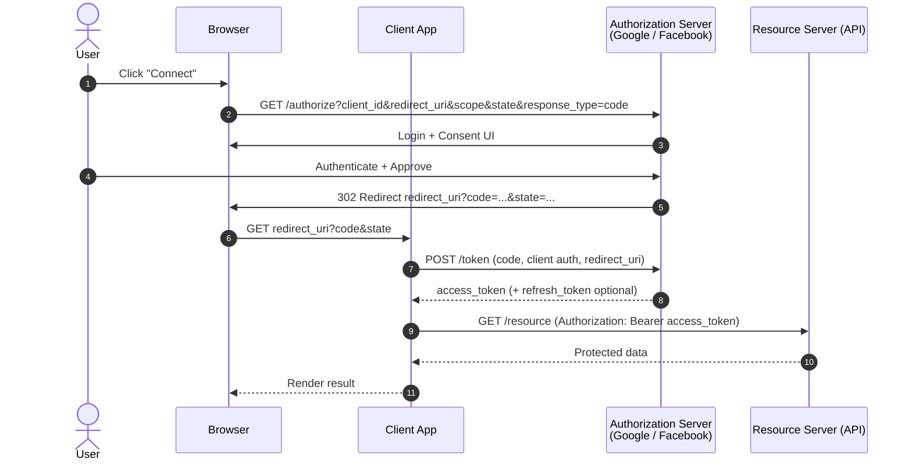
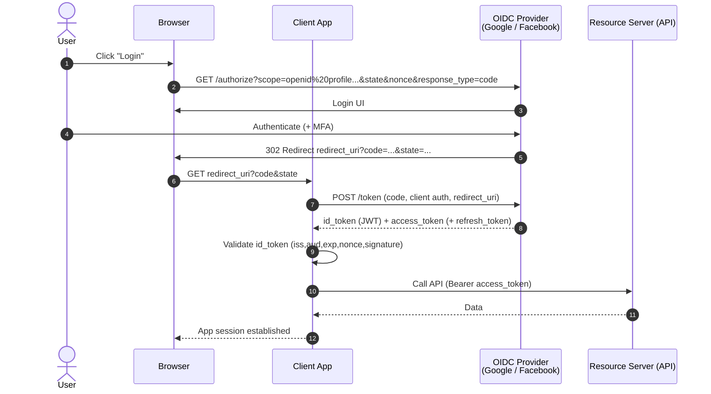
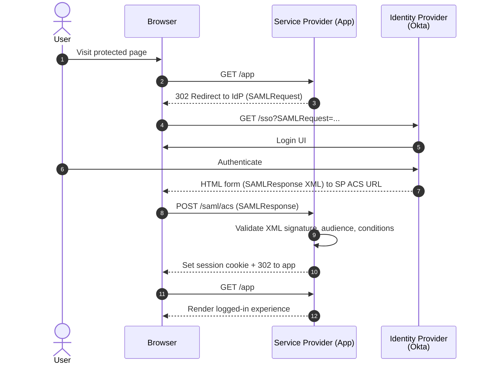

## OAuth 2.0 (Authorization flow – no identity)
 - I authorize this app to read/write these resources.

## OIDC — Authorization Code (OAuth2 + ID Token)
- I authenticate the user and also get OAuth tokens.

## SAML 2.0 — Web SSO (HTTP Redirect + POST)
- The enterprise identity provider asserts who the user is (XML).

